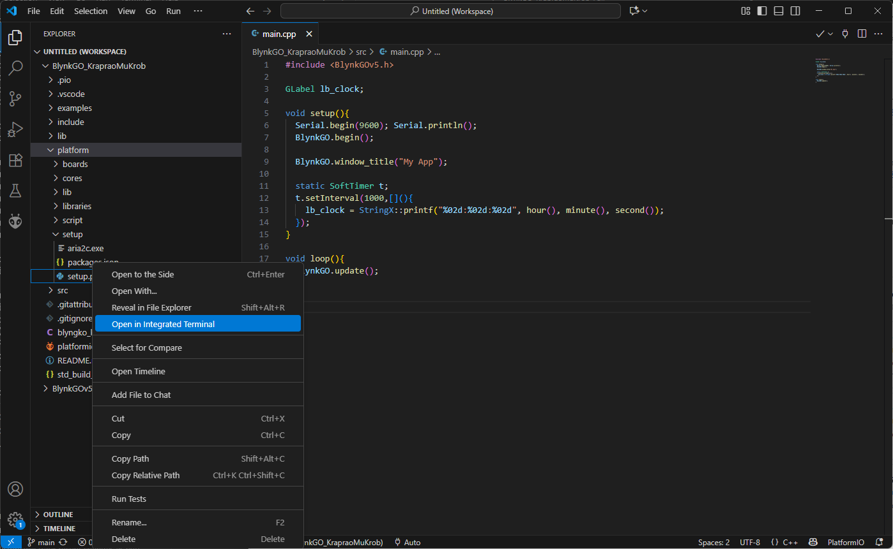
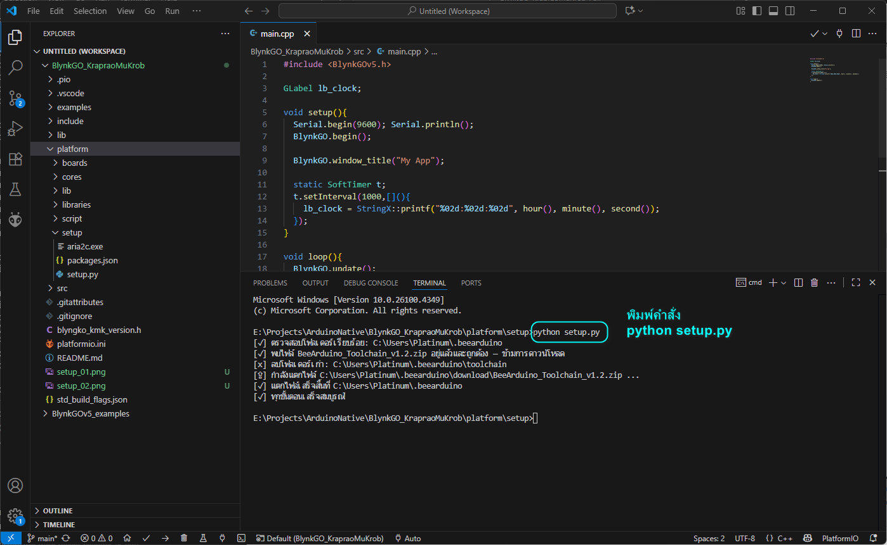
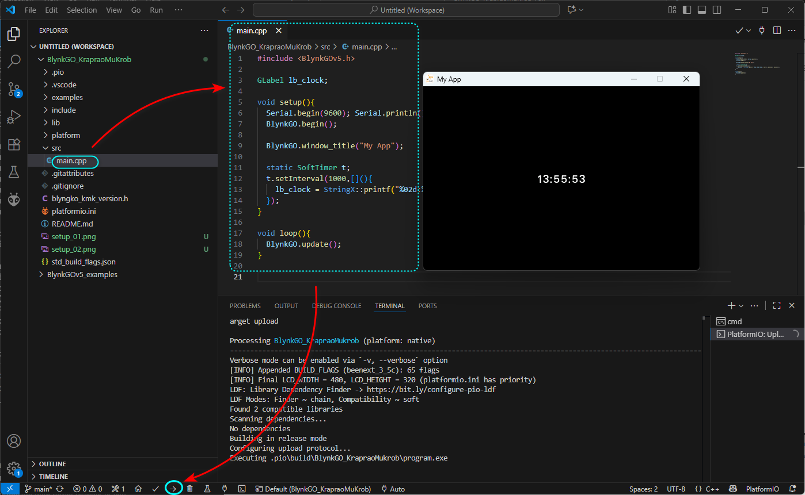

# BlynkGO_KrapraoMuKrob
**BlynkGO กระเพราหมูกรอบ**

**โปรแกรมนี้เป็นตัวสร้างโปรแกรมกราฟิกสำหรับ Windows**  
ใช้สำหรับ **ออกแบบกราฟิกสำหรับจอ BeeNeXT** โดยช่วยให้ผู้ใช้สร้าง UI และฟังก์ชันต่าง ๆ ได้ง่ายขึ้น

## วิธีติดตั้ง

### 1. ติดตั้ง Python
- ดาวน์โหลด Python สำหรับ Windows: [https://www.python.org/downloads/windows/](https://www.python.org/downloads/windows/)  
- **ปิด AntiVirus & Windows Defender** ก่อนติดตั้ง  
- ให้เลือก **Add Python to PATH** ตอนติดตั้ง  

### 2. ติดตั้ง Visual Studio Code
- ดาวน์โหลด VS Code: [https://code.visualstudio.com/](https://code.visualstudio.com/)
- ติดตั้งให้เรียบร้อย

### 3. ติดตั้ง PlatformIO Extension ใน VS Code
- เปิด VS Code → ไปที่ Extensions → ค้นหา `PlatformIO IDE` → **ติดตั้ง**

### 4. ดาวน์โหลด BlynkGO_KraproMuKrob
- ดาวน์โหลด **BlynkGO_KrapraoMuKrob**  
- **แตกไฟล์ ZIP** ลงในโฟลเดอร์ใดโฟลเดอร์หนึ่งบนเครื่องคุณ  

### 5. เปิดโปรเจคใน VS Code
- เปิด VS Code → **File → Open Folder** → เลือกโฟลเดอร์โปรเจคที่แตก ZIP มา  
- รอให้ **PlatformIO โหลดและติดตั้ง environment** ให้ครบถ้วน  

### 6. ติดตั้ง Toolchain (ทำครั้งเดียว)
- เข้าไปที่โฟลเดอร์: **BlynkGO_KraproMuKrob/platform/setup**
- เมาส์ขวา เลือกเมนู `Open in Integrated Termimal` เพื่อเปิด Terminal ขึ้นมา

  
- พิมพ์คำสั่ง `> python setup.py`

### 7. พร้อมใช้งาน BlynkGO_KrapraoMuKrob
- หลังจากตั้งค่าเสร็จแล้ว คุณสามารถ **build, upload/run** โปรเจคตามปกติผ่าน PlatformIO  

