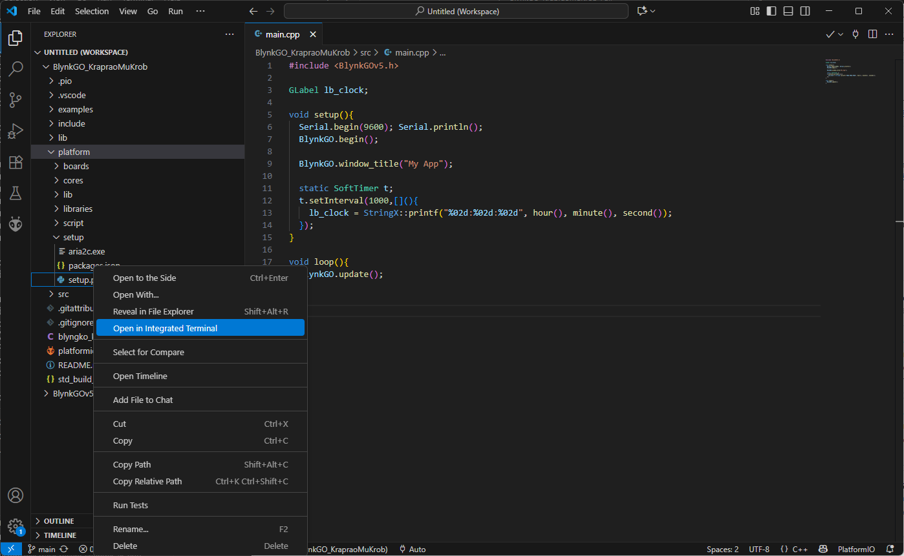
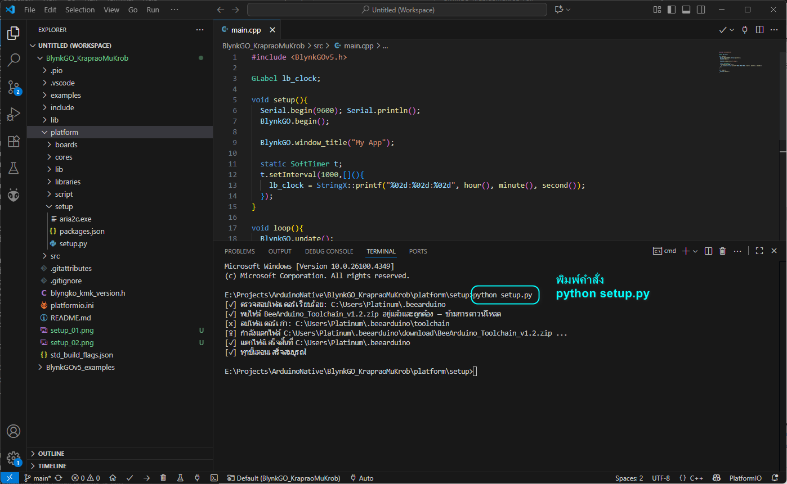

# BlynkGO_KrapraoMuKrob
## BlynkGO KrapraoMuKrob

This program is a graphical program generator for **Windows Application**,  
designed to create **GUI in Arduino code style**.  

It allows users to design UI and generate code  
that can run on **BeeNeXT touchscreen projects**.   
  
Additionally, it can connect to any MCU via **COM Port**   
and supports **HTTP Client** and **MQTT Client**.  

---

## Installation

### 1. Install Python
- Download Python for Windows: [https://www.python.org/downloads/windows/](https://www.python.org/downloads/windows/)  
- **Disable Antivirus & Windows Defender** before installation  
- Make sure to check **Add Python to PATH** during installation  

### 2. Install Visual Studio Code
- Download VS Code: [https://code.visualstudio.com/](https://code.visualstudio.com/)  
- Install it on your system

### 3. Install PlatformIO Extension in VS Code
- Open VS Code → go to **Extensions** → search for `PlatformIO IDE` → **Install**

### 4. Download BlynkGO_KrapraoMuKrob
- Download the **BlynkGO_KrapraoMuKrob** ZIP file  
- **Extract** the ZIP into any folder on your computer  

### 5. Open the project in VS Code
- Open VS Code → **File → Open Folder** → select the folder where you extracted the project  
- Wait for **PlatformIO** to load and set up the environment completely  

### 6. Install Toolchain and Tools (One-Time Setup)
- Navigate to the folder: **BlynkGO_KraproMuKrob/platform/setup**
- Right-click and select `Open in Integrated Terminal` to open the terminal.  

- Type the command `> python setup.py`

### 7. Ready to Use BlynkGO_KrapraoMuKrob
- You can select/change the board in `platformio.ini`.
- You can **build and upload/run** the project normally through PlatformIO,  
  and use the generated graphics in your BeeNeXT touchscreen projects.
  
  
  

