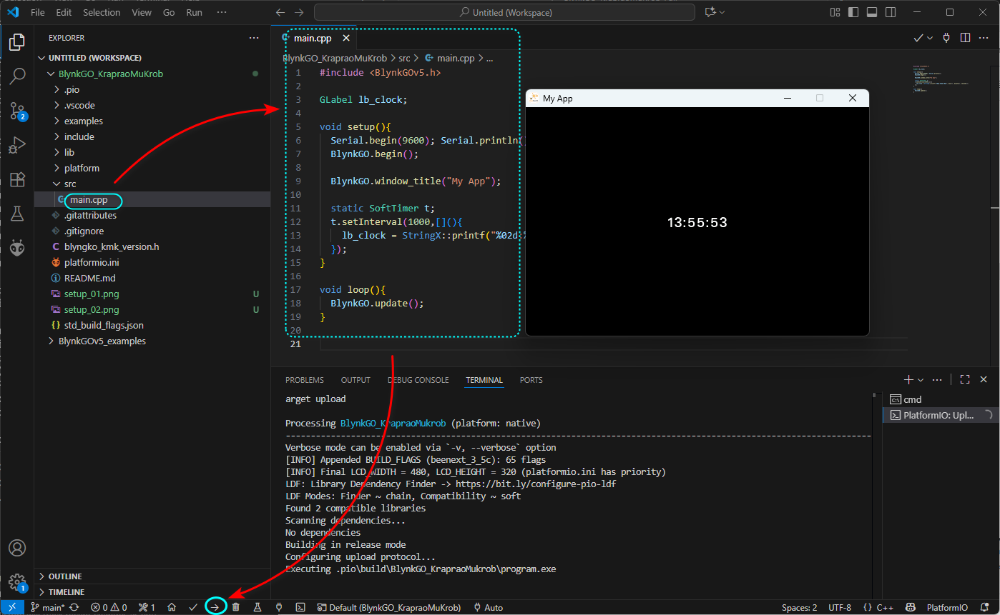

# BlynkGO_KrapraoMuKrob
## BlynkGO KrapraoMuKrob

This program is a graphical program generator for **Windows Application**,  
designed to create **GUI in Arduino code style**.  

It allows users to design UI and generate code  
that can run on **BeeNeXT touchscreen projects**.   
  
Additionally, it can connect to any MCU via **COM Port**   
and supports **HTTP Client** and **MQTT Client**.  

---
# Installation

## 1. Install Python

* Download Python for Windows: [https://www.python.org/downloads/windows/](https://www.python.org/downloads/windows/)
* **Disable Antivirus & Windows Defender** before installation
* Make sure to check **Add Python to PATH** during installation

## 2. Install Visual Studio Code

* Download VS Code: [https://code.visualstudio.com/](https://code.visualstudio.com/)
* Install it on your system

## 3. Install PlatformIO Extension in VS Code

* Open VS Code → go to **Extensions** → search for `PlatformIO IDE` → **Install**

## 4. Install Git

* Download Git for Windows: [https://git-scm.com/install/windows](https://git-scm.com/install/windows)
* Install Git on your system

## 5. Clone BlynkGO_KrapraoMuKrob

* Open a terminal (CMD/PowerShell)
* **Navigate to the folder** where you want to clone the project, for example:

```bash
cd C:\MyProjects
```

* Run the clone command:

```bash
git clone https://github.com/BlynkGO/BlynkGO_KrapraoMuKrob
```

* Navigate into the project folder:

```bash
cd BlynkGO_KrapraoMuKrob
```

**Note:**

* To protect your project in the **src/** folder from being overwritten during future updates,  
  run the following command to ignore local changes:

```bash
git update-index --skip-worktree src/*
```

* For future updates from the repository, use:

```bash
git pull
```


## 6. Open the project in VS Code

* Open VS Code → **File → Open Folder** → select the folder **BlynkGO_KrapraoMuKrob**
* Wait for **PlatformIO** to load and set up the environment completely

## 7. Ready to Use BlynkGO_KrapraoMuKrob

* You can select/change the board in `platformio.ini`.
* Build and upload/run the project normally through PlatformIO,
  and use the generated graphics in your BeeNeXT touchscreen projects.

> (First time: the toolchain and other necessary tools will be installed automatically.)

    
  
  
---
## Create a New BlynkGO Project

* In VS Code, **open the integrated terminal**:

  * Go to the menu: `Terminal → New Terminal` (or use the shortcut `` Ctrl+` `` )
  * Make sure the terminal is in the folder where you want to create your project
* Run the command:

```bash
> new_blynkgo
```

* In the `src` folder, a new `main.cpp` file will be automatically created with the following code:

```c
#include <BlynkGOv5.h>

void setup(){
  Serial.begin(9600); Serial.println();
  BlynkGO.begin();
}

void loop(){
  BlynkGO.update();
}
```
If an existing project exists, it will be automatically renamed as `main.cpp_YYYYMMDD_HHMMSS`.

---  
## 📖 How to convert Image for using in your project.

### 1️⃣ Prepare Your Images
Place the image files (PNG, JPG, BMP) that you want to convert into the folder:
`src/images`

### 2️⃣ Convert Standard Images (PNG, JPG, BMP)
Open a Terminal in the `src/images` folder containing the images to convert, then type:

```
> imgconv filename.png
```

or

```
> imgconv filename.jpg
> imgconv filename.bmp
```

### 3️⃣ Convert PNG Images with Transparency
To preserve transparency in the image, add the `-t` option:

```
> imgconv filename.png -t
```

🖼️ The converted files will be saved in the folder:
`src/images/output`

### 4️⃣ Set Your Own Output Filename
To specify a custom output filename, add the `-o` option followed by the desired name:

```
> imgconv filename.png -o desired_name
```

* Example: *

```
> imgconv logo.png -o my_logo
```

This will generate a file named `my_logo.c` in `src/images/output`.
  

