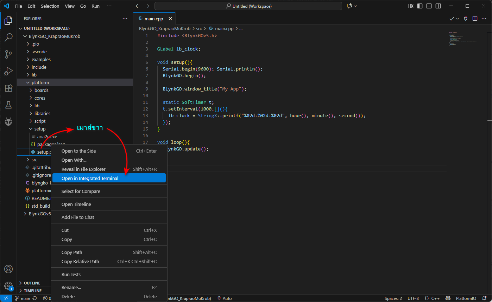

# BlynkGO_KrapraoMuKrob
BlynkGO กระเพราหมูกรอบ

## วิธีติดตั้ง

### 1. ติดตั้ง Python
- ดาวน์โหลด Python สำหรับ Windows: [https://www.python.org/downloads/windows/](https://www.python.org/downloads/windows/)
- แนะนำเลือก **Add Python to PATH** ตอนติดตั้ง

### 2. ติดตั้ง Visual Studio Code
- ดาวน์โหลด VS Code: [https://code.visualstudio.com/](https://code.visualstudio.com/)
- ติดตั้งให้เรียบร้อย

### 3. ติดตั้ง PlatformIO Extension ใน VS Code
- เปิด VS Code → ไปที่ Extensions → ค้นหา `PlatformIO IDE` → ติดตั้ง

### 4. ดาวน์โหลด BlynkGO_KraproMuKrob
- ดาวน์โหลด BlynkGO_KraproMuKrob
- แตกไฟล์ ZIP ลงในโฟลเดอร์ใดโฟลเดอร์หนึ่งบนเครื่องคุณ

### 5. เปิดโปรเจคใน VS Code
- เปิด VS Code → File → Open Folder → เลือกโฟลเดอร์โปรเจคที่แตก ZIP มา
- รอให้ PlatformIO โหลดและติดตั้ง environment ให้ครบถ้วน

### 6. ติดตั้ง Toolchain
- เข้าไปที่โฟลเดอร์: **BlynkGO_KraproMuKrob/platform/setup**
- เมาส์ขวา เลือกเมนู `Open in Integrated Termimal` เพื่อเปิด Terminal ขึ้นมา

  
- พิมพ์คำสั่ง `> python setup.py`

### 7. พร้อมใช้งาน BlynkGO_KrapraoMuKrob
- หลังจากตั้งค่าเสร็จแล้ว คุณสามารถ build, upload หรือ run โปรเจคตามปกติผ่าน PlatformIO

หตุ:**  
> - ห้าม commit โฟลเดอร์ `.pio` และ `.vscode` ขึ้น GitHub  
> - ตรวจสอบให้แน่ใจว่า Python และ PlatformIO ติดตั้งเรียบร้อยก่อนเริ่มใช้งาน
